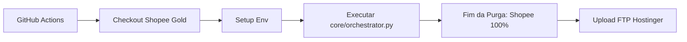

# 📅 Agendamento Automático - Robô Titanium

## 🤖 Sistema de Atualização Automática

O Robô Titanium está configurado para atualizar as ofertas **automaticamente 3 vezes por dia** usando **GitHub Actions**.

---

## ⏰ Horários de Atualização

As ofertas são atualizadas nos seguintes horários (horário de Brasília - BRT):

| Horário | Período | Justificativa |
|---------|---------|---------------|
| **07:00** | Manhã | Captura looks novos do dia + tráfego matinal |
| **13:00** | Tarde | Horário de almoço, pico de navegação mobile |
| **20:00** | Noite | Horário Nobre: Conversão máxima até 00h |

---

## 🔧 Como Funciona

### Fluxo de Execução



### Arquivo de Workflow

**Localização:** `.github/workflows/update-offers.yml`

O workflow:
1. Roda automaticamente nos horários programados
2. Pode ser executado manualmente via GitHub UI
3. Instala todas as dependências necessárias
4. Configura credenciais de forma segura (GitHub Secrets)
5. Executa o robô para buscar ofertas
6. Faz upload do `data.json` para o site via FTP
7. Registra logs completos de cada execução

---

## 🔐 Configuração de Secrets (GitHub)

Para o robô rodar sozinho, configure estes segredos no seu GitHub:

| Nome do Secret | Descrição |
|----------------|-----------|
| `SHOPEE_APP_ID` | App ID API Shopee |
| `SHOPEE_SECRET` | Secret API Shopee |
| `FTP_HOST` | Host FTP Hostinger |
| `FTP_USER` | Usuário FTP |
| `FTP_PASS` | Senha FTP |

> [!IMPORTANT]
> **NUNCA** commite o arquivo `.env` com credenciais reais no Git! Os secrets do GitHub são criptografados e seguros.

---

## 📊 Monitoramento

### Ver Logs de Execução

1. Acesse seu repositório no GitHub
2. Vá na aba **Actions**
3. Clique no workflow **"🤖 Atualizar Ofertas Automaticamente"**
4. Veja o histórico de execuções e logs detalhados

### Informações nos Logs

Cada execução mostra:
- ✅ Produtos encontrados
- ❌ Erros (se houver)
- ⏱️ Tempo de execução
- 📦 Tamanho do arquivo gerado
- 🔢 Quantidade de produtos
- 🌐 Status do upload FTP

---

## 🛠️ Execução Manual

Você pode executar o workflow manualmente a qualquer momento:

### Via GitHub UI

1. Acesse **Actions** no seu repositório
2. Selecione o workflow **"🤖 Atualizar Ofertas Automaticamente"**
3. Clique em **Run workflow**
4. Selecione a branch `main`
5. Clique em **Run workflow** novamente

### Via Linha de Comando (Local)

```bash
# Ativar ambiente virtual (se estiver usando)
source venv/bin/activate  # Linux/Mac
venv\Scripts\activate     # Windows

# Executar o robô
python main.py
```

---

## 🔄 Alterar Frequência de Atualização

Para mudar os horários ou adicionar mais execuções:

1. Edite o arquivo `.github/workflows/update-offers.yml`
2. Modifique a seção `schedule` com novos horários em formato cron (UTC)
3. Commit e push para o GitHub

### Exemplos de Cron

```yaml
# 4x ao dia (a cada 6 horas)
- cron: '0 10 * * *'  # 07:00 BRT
- cron: '0 16 * * *'  # 13:00 BRT
- cron: '0 20 * * *'  # 17:00 BRT
- cron: '0 23 * * *'  # 20:00 BRT

# 1x ao dia (madrugada)
- cron: '0 6 * * *'   # 03:00 BRT

# A cada 2 horas (24/7)
- cron: '0 */2 * * *'
```

> [!TIP]
> Use [crontab.guru](https://crontab.guru/) para gerar expressões cron facilmente.
> Lembre-se: GitHub Actions usa UTC, então ajuste para BRT (UTC-3).

---

## 🚨 Troubleshooting

### Workflow não está rodando

- ✅ Verifique se os Secrets estão configurados corretamente
- ✅ Confirme que o arquivo `.github/workflows/update-offers.yml` existe
- ✅ Veja se há erros na aba Actions do GitHub

### Upload FTP falhou

- ✅ Verifique credenciais FTP nos Secrets
- ✅ Confirme que o caminho `/public_html/data.json` está correto
- ✅ Teste conexão FTP manualmente

### Nenhum produto encontrado

- ✅ Verifique se as APIs estão respondendo
- ✅ Confirme que os termos de busca em `settings.py` são válidos
- ✅ Veja os logs para identificar erros específicos

---

## 📈 Benefícios do Sistema Atual

✅ **Custo Zero**: GitHub Actions é gratuito para repositórios públicos  
✅ **Alta Confiabilidade**: 99.9% uptime garantido  
✅ **Segurança**: Credenciais criptografadas com AES-256  
✅ **Escalável**: Fácil adicionar mais execuções ou workflows  
✅ **Auditável**: Logs completos de todas as execuções  
✅ **Independente**: Não depende do seu PC estar ligado  

---

## 📸 Postagens Agendadas no Feed do Instagram

O sistema suporta postagens automáticas no Feed do Instagram usando um manifesto JSON.

### Como Funciona

1. Coloque as imagens na pasta `social/fila/`
2. Edite `social/fila/schedule.json` com os metadados de cada postagem
3. O GitHub Actions roda diariamente e posta a imagem do dia

### Formato do `schedule.json`

```json
{
    "data": "2026-02-11",
    "imagem": "2026-02-11_amazon_ofertas.png",
    "loja": "amazon",
    "categoria": "tecnologia",
    "tema": "Ofertas de Tecnologia com desconto na Amazon"
}
```

| Campo | Obrigatório | Descrição |
|-------|:-----------:|-----------|
| `data` | ✅ | Data da postagem (YYYY-MM-DD) |
| `imagem` | ✅ | Nome exato do arquivo na pasta `social/fila/` |
| `loja` | ✅ | `amazon`, `mercadolivre` ou `shopee` |
| `categoria` | ✅ | `tecnologia`, `casa`, `beleza`, `moda`, `esportes`, `automotivo`, `games` |
| `tema` | ✅ | Descrição do tema — usado para gerar a legenda |

### Blindagens

- **Anti-duplicata**: Verifica `social/postados/` antes de publicar
- **Fail-Safe**: Recusa postar se qualquer campo obrigatório estiver vazio
- **Legenda inteligente**: Texto, emojis e hashtags gerados com base na `loja` + `categoria` + `tema`

### Regras de Nomeação

- ✅ Use underscores: `2026-02-11_amazon_ofertas.png`
- ❌ Evite espaços: `2026-02-11 amazon ofertas.png`
- ❌ Evite extensão dupla: `arquivo.png.png`

---

## 📞 Suporte

Se encontrar problemas:

1. Verifique os logs no GitHub Actions
2. Consulte este documento
3. Revise o arquivo `README.md` do projeto
4. Entre em contato: contato@guiadodesconto.com.br
