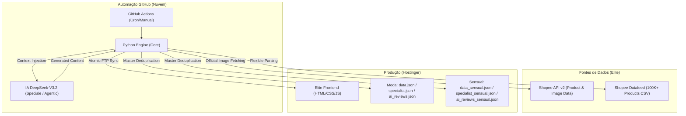

# 🧠 Titanium Brain: System Architecture Map (v2026.1)

Este documento descreve a topologia de alto nível e o fluxo de dados do ecossistema **Titanium Shopee Exclusive** (v3.9.7-Nuclear).

---

## 🏗️ 1. Filosofia: Desacoplamento de Estado & Verticais Especializadas

O sistema segue uma arquitetura onde o **Frontend é agnóstico**:
- O site em produção (Hostinger) não depende de um banco de dados SQL pesado.
- Toda a "inteligência" e "estado" do site (ofertas, preços, textos de IA) são injetados via arquivos JSON estáticos.
- **Deduplicação Master**: Implementado um sistema de exclusividade hierárquica para garantir que nenhum produto se repita entre as seções.
- **Multivirtines Estratégicas**: O sistema agora suporta verticais independentes (Titanium Moda e Boutique Íntima) com motores de renderização e pools de dados específicos.

---

## 🗺️ 2. Topologia de Componentes

---

## 📊 3. Ciclo de Vida do Dado

1.  **Gatilho (Trigger)**: O GitHub Actions "acorda" nos horários agendados (07h, 13h, 20h, Domingos).
2.  **Mineração & Curação**:
    - O motor Python acessa a API Oficial da Shopee.
    - O **Arbitro** valida se os produtos ainda existem e se os preços são competitivos.
    - A **IA DeepSeek** gera textos persuasivos e técnicos para o Editorial e o Radar (Moda e Íntima).
3.  **Sincronização Atômica**:
    - Os arquivos de estado são enviados via FTP.
    - O `index.html` e `sensual.html` mestres são usados como templates seguros.
4.  **Hidratação Dinâmica**:
    - Os motores `app.js` e `app_sensual.js` fazem um `fetch` leve do JSON correspondente e renderizam as ofertas instantaneamente.

---

## 🔐 4. Protocolo de Segurança (Blindagem & Sanitização)

- **Secrets Only**: Credenciais (`FTP`, `API_KEYS`) residem exclusivamente no GitHub Secrets. **NUNCA** commitar arquivos `.env` ou scripts com chaves expostas.
- **Structural Shield**: Scripts automáticos são proibidos de sobrescrever arquivos estruturais (`.php`, `.htaccess`, `.css`) em modo PRODUCTION. 
- **Nuclear Shield (v3.9.8)**: 100% dos links (API, CSV, Site e Social) passam obrigatoriamente pela blindagem.
    - **Python Gate**: `infra/shield.py` atua como um "Gatekeeper" mandatório em todos os GitHub Workflows. Auditado para garantir que não há tags incorretas (como `an_1775854827323` que foi removida). Todas as tags agora apontam obrigatoriamente para `an_18318830863`.
    - **PHP Gate**: `bot_instagram.php` integra a função `titanium_shield` para auditar links em tempo real nas DMs.
    - **Injeção Atômica**: Garantia de 100% de cobertura da tag `an_18318830863`.
    - **Search Integration**: A lógica de busca do `app_sensual.js` e `app.js` garante o redirecionamento com a Tag Universal embutida via Deep Link Shopee App Fallback.
- **Sanitização de Dados**: Auditoria recorrente para garantir que logs de execução e arquivos de debug não contenham metadados sensíveis do servidor ou da conta de afiliado.

---
*Atualizado em: 06/05/2026 - Versão: 3.9.8-SeniorAudit (Global Shield Gate & Sensual Automated FTP Deploys)*
