# 🧠 Titanium Brain: System Architecture Map (v5.5.0-Elite)

Este documento descreve a topologia de alto nível e o fluxo de dados do ecossistema **Titanium Shopee Exclusive** — validado em produção com postagem automática, preço BR e DM bot funcional.

---

## 🏗️ 1. Filosofia: Desacoplamento & Resiliência Visual

O sistema evoluiu para um modelo de **Máxima Autoridade Visual**:
- **Aesthetics First**: O design das artes (frames 1080x1920) segue o padrão "Magazine Elite", priorizando tipografia luxuosa e espaços negativos.
- **Media Resilience (V5)**: O robô agora detecta gargalos de infraestrutura em tempo real. Se o processamento de Reels (vídeo) falhar por instabilidade da API ou FTP, o sistema executa um fallback atômico para **Imagem Premium**, garantindo 100% de presença diária.
- **Deduplicação Master**: Sistema de exclusividade hierárquica aprimorado para evitar cross-posting entre Moda e Boutique Íntima.

---

## 🛰️ 2. Titanium Control Tower (Monitoramento & Finanças)

Implementada a lógica de observabilidade e financeiro centralizados:
- **monitor.json**: Arquivo de estado persistente que rastreia KPIs (Posts realizados, Erros de API, Status de Processamento).
- **Dashboard em Tempo Real**: Interface visual que consome o log de saúde para fornecer uma visão executiva do bot sem necessidade de ler logs de console.
- **Titanium Financial Alerts**: Integração com a API GraphQL de Afiliados da Shopee e Telegram Bot. Notifica vendas, conversões estimadas e líquidas em tempo real diretamente no celular do administrador (o famoso "Plim!").

---

## 🗺️ 3. Topologia de Componentes

```mermaid
graph TD
    subgraph "Automação GitHub (Nuvem)"
        ACTION["GitHub Actions (Cron/Manual)"]
        PYTHON["Python Engine (Core v5.0)"]
        AI["IA DeepSeek-V3.2 (Premium Copywriter)"]
        SALES["Sales Tracker (Cron 2h)"]
    end

    subgraph "Fontes de Dados (Elite)"
        SHP["Shopee API v2 (Elite Media Assets)"]
        FEED["Shopee Datafeed (100K Pool Integration)"]
        GRAPHQL["Shopee GraphQL (Affiliate Conversions)"]
    end

    subgraph "Infra de Mídia (Hybrid)"
        CLOUD["Cloud Backup (Resilient Delivery via CDN)"]
        GITHUB["GitHub Raw (Fastly CDN)"]
    end

    subgraph "Produção (Instagram/Web/Notificação)"
        INSTA["Instagram API (Postage & DMs)"]
        SITE["Elite Frontend (data.json)"]
        IG_PAGE["Link in Bio Page (instagram.html + instagram_posts.json)"]
        TG["Telegram API (Bot Alerts)"]
    end

    ACTION --> PYTHON
    PYTHON -- "Context Injection" --> AI
    AI -- "High-Conversion Copy" --> PYTHON
    PYTHON -- "Git Auto-Commit" --> GITHUB
    PYTHON -- "Force Cloud Upload" --> CLOUD
    PYTHON -- "Post Logic" --> INSTA
    PYTHON -- "Log Posts" --> IG_PAGE

    
    ACTION --> SALES
    SALES -- "Fetch Conversions" --> GRAPHQL
    SALES -- "Send Plim!" --> TG
```

---

## 📊 4. Ciclo de Vida do Dado & Postagem

1.  **Gatilho (Trigger)**: GitHub Actions atua nos 4 horários nobres (08:30, 14:30, 19:30, 23:30 BRT).
2.  **Curação Elite**: Mineração via Datafeed 100K filtrada por semântica sazonal (Inverno 2026).
3.  **Arte Premium**: Frame 1080x1920 com preço formatado em padrão BR (`_parse_price`) e design Magazine Elite.
4.  **Upload Resiliente**: Cloud bypass nativo via CDN (`tmpfiles.org`) para mídias (Reels e Imagens) bloqueando falhas de firewall.
5.  **Postagem**: Imagem Premium no Feed do Instagram via Graph API.
6.  **DM Bot**: Resposta automática com link rastreado (`an_18318830863`) + preview do produto.
7.  **Security Gate**: `infra/shield.py` valida 100% dos links antes do deploy.

---

## 🔐 5. Protocolo de Segurança (Nuclear Shield v5.0)

- **Secrets Only**: Blindagem total de credenciais.
- **Nuclear Shield (v5.0)**: 100% dos links de produtos Shopee são auditados e convertidos usando a API moderna `ShopeeAffiliateAPI` em `scraper/engines/shopee_affiliate.py`. O fallback antigo que injetava `utm_source` manualmente foi removido, pois essa tag não garante comissão no painel da Shopee.
- **Deep Link Proxy (go.php v2.0)**: Nova ponte de redirecionamento anti-Instagram In-App Browser. O robô de DMs envolve os links Shopee na rota `https://guiadodesconto.com.br/go.php?url=...`. O proxy detecta o dispositivo do usuário (Android/iOS) e força a abertura direta dentro do aplicativo nativo da Shopee, contornando o navegador interno do Instagram e preservando os cookies de atribuição de comissão.
- **Bypass Estratégico**: Roteamento HTTPS (GitHub Raw CDN) para persistência e leitura de dados (`ofertas.json`), eliminando falhas de firewall e timeout de FTP.

---
*Atualizado em: 08/06/2026 - Versão: v5.8.0-SalesTracker (Integração Shopee GraphQL e Telegram Bot)*
