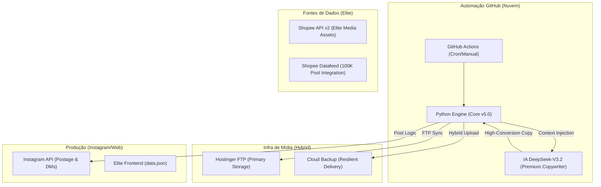

# 🧠 Titanium Brain: System Architecture Map (v5.0.0-PremiumElite)

Este documento descreve a topologia de alto nível e o fluxo de dados do ecossistema **Titanium Shopee Exclusive** em sua fase de estabilização Premium Elite.

---

## 🏗️ 1. Filosofia: Desacoplamento & Resiliência Visual

O sistema evoluiu para um modelo de **Máxima Autoridade Visual**:
- **Aesthetics First**: O design das artes (frames 1080x1920) segue o padrão "Magazine Elite", priorizando tipografia luxuosa e espaços negativos.
- **Media Resilience (V5)**: O robô agora detecta gargalos de infraestrutura em tempo real. Se o processamento de Reels (vídeo) falhar por instabilidade da API ou FTP, o sistema executa um fallback atômico para **Imagem Premium**, garantindo 100% de presença diária.
- **Deduplicação Master**: Sistema de exclusividade hierárquica aprimorado para evitar cross-posting entre Moda e Boutique Íntima.

---

## 🛰️ 2. Titanium Control Tower (Monitoramento)

Implementada a lógica de observabilidade centralizada:
- **monitor.json**: Arquivo de estado persistente que rastreia KPIs (Posts realizados, Erros de API, Status de Processamento).
- **Dashboard em Tempo Real**: Interface visual que consome o log de saúde para fornecer uma visão executiva do bot sem necessidade de ler logs de console.

---

## 🗺️ 3. Topologia de Componentes

---

## 📊 4. Ciclo de Vida do Dado & Postagem

1.  **Gatilho (Trigger)**: GitHub Actions atua nos 4 horários nobres (Inverno 2026).
2.  **Curação Elite**: Mineração via Datafeed filtrada por semântica de luxo e sazonalidade.
3.  **Media Hardening**: Geração de vídeo (Reels) com áudio silencioso e resolução nativa 1080x1920.
4.  **Security Gate**: Validação mandatória via `infra/shield.py` antes de qualquer link chegar ao público.

---

## 🔐 5. Protocolo de Segurança (Nuclear Shield)

- **Secrets Only**: Blindagem total de credenciais.
- **Nuclear Shield (v5.0)**: 100% dos links auditados. Tag Universal `an_18318830863` injetada via Deep Link para garantir comissão em dispositivos móveis.
- **Bypass Estratégico**: Implementação de rotas HTTPS para download de mídias pela Meta API, evitando bloqueios de firewall da Hostinger.

---
*Atualizado em: 08/05/2026 - Versão: v5.0.0-PremiumElite (Stabilization & Control Tower)*
