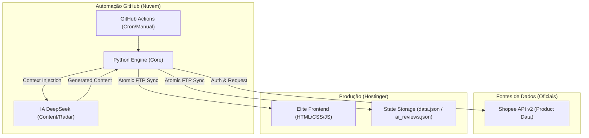

# 🧠 Titanium Brain: System Architecture Map (v2026)

Este documento descreve a topologia de alto nível e o fluxo de dados do ecossistema **Robô Titanium: Shopee Exclusive**.

---

## 🏗️ 1. Filosofia: Desacoplamento de Estado (Stateless)

O sistema segue uma arquitetura onde o **Frontend é agnóstico**:
- O site em produção (Hostinger) não depende de um banco de dados SQL pesado.
- Toda a "inteligência" e "estado" do site (ofertas, preços, textos de IA) são injetados via arquivos JSON estáticos.
- Isso garante que o site carregue em menos de 1 segundo e suporte picos massivos de tráfego sem cair.

---

## 🗺️ 2. Topologia de Componentes

---

## 📊 3. Ciclo de Vida do Dado

1.  **Gatilho (Trigger)**: O GitHub Actions "acorda" nos horários agendados (07h, 13h, 20h, Domingos).
2.  **Mineração & Curação**:
    - O motor Python acessa a API Oficial da Shopee.
    - O **Arbitro** valida se os produtos ainda existem e se os preços são competitivos.
    - A **IA DeepSeek** gera textos persuasivos e técnicos para o Editorial e o Radar.
3.  **Sincronização Atômica**:
    - Os arquivos de estado (`data.json`) são enviados via FTP.
    - O `index.html` mestre é usado como template seguro.
4.  **Hidratação Dinâmica**:
    - O `app.js` no navegador do usuário faz um `fetch` leve do JSON e renderiza as ofertas instantaneamente.

---

## 🔐 4. Protocolo de Segurança (Blindagem)

- **Secrets Only**: Credenciais (`FTP`, `API_KEYS`) residem exclusivamente no GitHub Secrets de forma encriptada.
- **Structural Shield**: Scripts automáticos são proibidos de sobrescrever arquivos estruturais (`.php`, `.htaccess`, `.css`) para evitar ataques de injeção ou corrupção de design (Blindagem Production).
- **AI Dual-Engine**: Uso de **Groq (Llama 3)** para velocidade em curadoria e **DeepSeek** para qualidade editorial.
- **Link Auditing**: 100% dos links são gerados via deeplink oficial Shopee, garantindo a comissão do proprietário.

---
*Atualizado em: 12/04/2026 - Versão: 3.2.0-Elite (Shopee Full Sync)*
