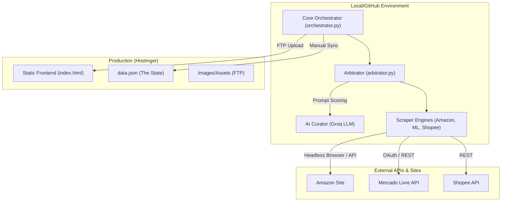

# 🧠 Titanium Brain: System Architecture Map

This document describes the high-level topology and data flow of the **Robô Titanium** ecosystem.

## 🏗️ Core Philosophy: Hybrid Decoupling
The system is built on a "Stateless Pro-Active" architecture. The frontend is a high-performance static site, while the backend is a modular Python engine that injects state via JSON and FTP.

### Component Topology

## 📊 Data Flow Cycle

1.  **Trigger**: GitHub Actions (Cron) or Manual Execution.
2.  **Scraping**: The engine parallelizes searches across e-commerce platforms.
3.  **Arbitration**: 
    - The **Arbitro** filters results for validity (Recency, Image quality, Price).
    - The **AI Curator** compares matches and selects the single best "Deal of the Moment".
4.  **Serialization**: The final product list is saved as `data.json`.
5.  **Synchronization**: 
    - Files are pushed via `infra/deploy.py` or directly to Hostinger via FTP.
6.  **Hydration**: The frontend JS (`app.js`) fetches `data.json` and renders the cards dynamically.

## 📁 Key Directories & Modules

### `/core`: The Logic
- `orchestrator.py`: The "Main Loop" that coordinates trends and manual updates.
- `arbitrator.py`: The comparison engine.
- `tokens.py`: Secure OAuth token handling for ML.

### `/scraper`: The Ingestion
- `engines/`: Store-specific scrapers.
- `utils/`: Common scraping helpers (Driver setup, proxy-like delays).

### `/social`: The Visibility
- `automation/`: Post-scheduling scripts.
- `core/bot.py`: Image generation and IG Graph API bridge.

### `/infra`: The Backbone
- `deploy.py`: Atomic FTP deployment for the site.
- `upload_logic.py`: Resilient file transfer.
- `ResilientUploader` (in `social/core/uploader.py`): Multi-channel orchestrator (FTP + ImgBB Cloud) optimized for Instagram Graph API accessibility.

---
> [!NOTE]
> This architecture is designed for **Resilience**. If any API component fails, the fallback scrapers take over. If the entire backend is down, the frontend remains functional using the last successful `data.json`.
