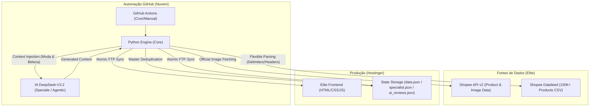

# 🧠 Titanium Brain: System Architecture Map (v2026)

Este documento descreve a topologia de alto nível e o fluxo de dados do ecossistema **Titanium Shopee Exclusive** (v3.8.0-Nuclear).

---

## 🏗️ 1. Filosofia: Desacoplamento de Estado & Deduplicação Master

O sistema segue uma arquitetura onde o **Frontend é agnóstico**:
- O site em produção (Hostinger) não depende de um banco de dados SQL pesado.
- Toda a "inteligência" e "estado" do site (ofertas, preços, textos de IA) são injetados via arquivos JSON estáticos.
- **Deduplicação Master**: Implementado um sistema de exclusividade hierárquica para garantir que nenhum produto se repita entre as seções:
    1. **Prioridade 1: Specialist (Platinum)** - Itens fixos de alta curadoria.
    2. **Prioridade 2: Radar de Tendências (IA)** - Tendências dinâmicas geradas pela DeepSeek.
    3. **Prioridade 3: Vitrine Principal (Maestro)** - Ofertas diárias em massa.
- Isso garante que o site carregue em menos de 1 segundo e suporte picos massivos de tráfego sem cair.

---

## 🗺️ 2. Topologia de Componentes

---

## 📊 3. Ciclo de Vida do Dado

1.  **Gatilho (Trigger)**: O GitHub Actions "acorda" nos horários agendados (07h, 13h, 20h, Domingos).
2.  **Mineração & Curação**:
    - O motor Python acessa a API Oficial da Shopee.
    - O **Arbitro** valida se os produtos ainda existem e se os preços são competitivos.
    - A **IA DeepSeek** gera textos persuasivos e técnicos para o Editorial e o Radar.
3.  **Sincronização Atômica**:
    - Os arquivos de estado (`data.json`) são enviados via FTP.
    - O `index.html` mestre é usado como template seguro.
4.  **Hidratação Dinâmica**:
    - O `app.js` no navegador do usuário faz um `fetch` leve do JSON e renderiza as ofertas instantaneamente.

---

## 🔐 4. Protocolo de Segurança (Blindagem)

- **Secrets Only**: Credenciais (`FTP`, `API_KEYS`) residem exclusivamente no GitHub Secrets de forma encriptada.
- **Structural Shield**: Scripts automáticos são proibidos de sobrescrever arquivos estruturais (`.php`, `.htaccess`, `.css`) em modo PRODUCTION. Mudanças de layout são exclusivas do modo STAGING ou via scripts de força bruta (`force_asset_upload.py`), o que garante a Blindagem Production.
- **Isolated Environments**: 
    - **PRODUCTION**: Atualiza estritamente o `data.json` e `notifications.json`.
    - **STAGING**: Sincroniza `index_staging.html`, `app.js` e `style.css` automaticamente para validação imediata.
- **AI-Only (DeepSeek)**: Uso exclusivo da API **DeepSeek-V3.2 (Speciale)** para curadoria e editorial de alto nível. O sistema aproveita o "Extreme Reasoning" para garantir que cada recomendação de produto seja cirúrgica.
- **Nuclear Shield (v3.8)**: 100% dos links (API, CSV e Social) passam pelo `core/link_builder.py` e são auditados obrigatoriamente pelo `infra/shield.py` antes de qualquer upload. Injeção mandatória da tag `an_18318830863` com inteligência anti-duplicação.
- **Analytics Shield**: Integração de eventos `click` via `gtag` para comparação direta tráfego vs. conversão Shopee.

- **Editorial SEO Max**: O sistema gera artigos semanais com mais de 1000 palavras, injetando produtos reais do Datafeed para máxima autoridade (E-E-A-T) e aprovação no AdSense.

- **Extreme Vitrine Density**: Expansão do pool de mineração de 30 para **100 itens** e retenção de até **80 produtos históricos**, garantindo uma vitrine sempre densa e luxuosa (70-90 itens únicos após deduplicação).

---
*Atualizado em: 23/04/2026 - Versão: 3.8.0-Nuclear (Nuclear Shield + MutationObserver Protection)*
