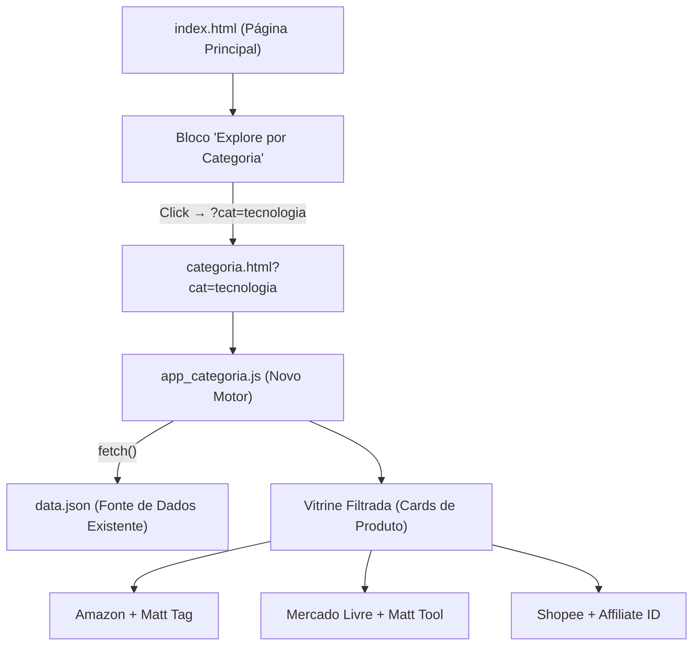

# 🗂️ PROPOSAL-001: Vitrine por Categoria (Category Showcase v1.0)

> **Status:** 🚀 Em Implementação / Beta (Staging)
> **Criado em:** 2026-03-20
> **Última Análise:** 30/03/2026 (Fix do Bug do Bandeirão Verde & Alinhamento de Cards)
> **Ambiente de Teste:** https://teste.guiadodesconto.com.br/
> **Prioridade:** Alta — Próxima evolução da plataforma Guia do Desconto

---

## 🔍 Diagnóstico Sênior do Site Atual (2026-03-21)

> [!IMPORTANT]
> Análise visual completa realizada via browser em 2026-03-21. Os achados abaixo **devem ser resolvidos ANTES ou DURANTE** a implementação desta proposta para garantir a aprovação no Google AdSense.

### 🚨 Problema Crítico #1 — Identidade de Marca Dividida (Branding Inconsistente)
O site em `guiadodesconto.com.br` exibe o logo e nome **"Oferta Certa"** em TODAS as páginas:
- **Header:** Logo com "Oferta Certa — SUA NOVA BOUTIQUE DE MODA & BELEZA"
- **Rodapé:** Logo "Oferta Certa" + texto "Encontramos as melhores ofertas para você economizar"
- **Página `sobre.html`:** Título "Sobre o Oferta Certa" e toda a missão referenciando "Oferta Certa"
- **Política de Privacidade:** Cita "Oferta Certa" como responsável pelos dados
- **Única exceção:** Copyright no final do rodapé diz "© 2026 Guia do Desconto"

**Impacto:** Para o revisor do Google AdSense, esse conflito entre domínio e identidade visual parece um site desonesto, clonado ou inacabado. É o principal motivo de rejeição.

**Solução necessária:** Fazer um `grep` global em todos os HTMLs, CSSs e JSs e substituir TODAS as ocorrências de "Oferta Certa" por "Guia do Desconto".

### 🚨 Problema Crítico #2 — "Thin Content" (Conteúdo Raso)
O site é 100% composto por grades de produtos afiliados sem texto editorial próprio:
- Nenhuma descrição original de produto
- Nenhum artigo, review ou comparativo
- O texto de curadoria na homepage ("Produtos selecionados automaticamente...") é uma única linha genérica
- O AdSense classifica isso como **"Made for Ads" (MFA)** — sites criados apenas para exibir anúncios sem valor real ao usuário

**Solução:** Adicionar pelo menos 3-4 parágrafos editoriais na homepage explicando a proposta de valor, a metodologia de curadoria e o diferencial do site. A **PROPOSAL-001 (Category Showcase)** resolve parcialmente isso ao criar páginas de categoria com contexto editorial.

### ⚠️ Problema #3 — Ausência de Menu de Navegação no Header
O header do site tem apenas: Logo + "Robô Online" + "Links Auditados". Nenhum menu de navegação.
Os links para "Sobre", "Contato", "Privacidade" e "Termos" estão apenas no rodapé (escondidos).
O Google AdSense exige navegação clara e acessível.

**Solução:** Adicionar um `<nav>` no header com links para as páginas institucionais. **Deve ser feito durante a implementação desta proposta.**

### ✅ O que já está BOM (não alterar)
- Design moderno, limpo e atraente — transmite profissionalismo
- Selos de segurança no rodapé (Site Seguro, Google Safe Browsing, Lojas Oficiais)
- Páginas de Sobre, Privacidade e Contato **existem** (mas precisam de atualização de branding)
- Ticker de produtos no topo com preços — transmite dinamismo
- Chatbot Robô Online com mensagens de credibilidade

### 📋 Checklist Pré-Lançamento (AdSense)
Antes de solicitar nova revisão ao AdSense, confirmar:
- [ ] Todos os textos "Oferta Certa" renomeados para "Guia do Desconto"
- [ ] Logo atualizado com o nome correto
- [ ] Menu de navegação adicionado ao header
- [ ] Texto editorial adicionado à homepage (mínimo 300 palavras originais)
- [ ] Disclaimer de afiliado adicionado ao rodapé
- [ ] Página `sobre.html` reescrita com identidade do "Guia do Desconto"
- [ ] Category Showcase implementado (adiciona páginas com mais conteúdo)
- [ ] Revisão solicitada no painel do AdSense

---


## 🎯 Visão Geral (O Problema que Estamos Resolvendo)

Hoje, o Guia do Desconto funciona como uma **vitrine genérica**. O cliente entra, vê ofertas de categorias
misturadas e pode sair sem comprar porque não encontrou exatamente o que procurava.

**A Proposta:** Transformar cada bloco de "Explore por Categoria" em um portal de compras inteligente,
onde o cliente que clica em "Tecnologia" entra em uma página exclusivamente dedicada a tecnologia —
com produtos das 3 plataformas (Amazon, Mercado Livre, Shopee) já curados e comparados.

**Por que isso é uma "quase venda garantida"?**
- O usuário que clica em uma categoria está em **modo de compra ativo**, não de descoberta.
- Ao centralizar a comparação de preços entre as 3 marcas em uma única tela, eliminamos a principal
  razão de abandono: a necessidade de abrir várias abas para comparar.
- O cookie de afiliado é ativado **no clique final**, garantindo a comissão mesmo que o cliente
  mude de ideia dentro da loja.

---

## 🏗️ Arquitetura Proposta

### Filosofia: "Zero Back-End" (100% compatível com nossa arquitetura atual)

A solução foi desenhada para **não quebrar nenhuma regra da arquitetura Titanium**:
- Sem servidor extra. Sem banco de dados. Sem framework novo.
- O `data.json` existente é a única fonte de dados.
- O `app.js` existente é o único motor de renderização.
- Alto aproveitamento do código já existente.

### Fluxo do Usuário

```
[Página Principal] → Usuário clica em "Tecnologia"
        ↓
[URL]: teste.guiadodesconto.com.br/categoria.html?cat=tecnologia
        ↓
[categoria.html] → JS lê params da URL → Filtra data.json por categoria
        ↓
[Vitrine Filtrada] → Exibe só produtos de Tecnologia das 3 marcas
        ↓
[Clique no Produto] → Redireciona para Amazon/ML/Shopee COM TAG DE AFILIADO
        ↓
[💰 COMISSÃO GARANTIDA]
```

### Diagrama de Componentes



---

## 📁 Mapeamento de Arquivos (O que será criado/modificado)

| Ação | Arquivo | Descrição |
| :--- | :--- | :--- |
| `NEW` | `site/categoria.html` | A nova página de vitrine por categoria. Reutiliza o header e footer do index. |
| `NEW` | `site/js/app_categoria.js` | Motor JS que lê `?cat=X`, filtra o `data.json` e renderiza os cards. |
| `NEW` | `site/css/categoria.css` | Estilos específicos da página de categoria (layout 2 colunas, filtros). |
| `MODIFY` | `site/index.html` | Atualizar os links dos botões de categoria para apontar para `categoria.html?cat=X`. |
| `MODIFY` | `site/js/app.js` | Extrair funções compartilhadas (ex: `buildMLAffiliateUrl`) para um `utils.js`. |
| `MODIFY` | `core/settings.py` | Adicionar campo `categoria` nos `TARGETS` para classificação automática no scraper. |
| `MODIFY` | `scraper/engines/*.py` | Garantir que o campo `"categoria"` seja populado no JSON de saída de cada engine. |

---

## 💾 Mudança no `data.json` (Estrutura de Dados)

Cada produto no `data.json` precisará de um campo `"categoria"` para o filtro funcionar.

**Estrutura Atual:**
```json
{
  "title": "Smartphone Samsung Galaxy A55",
  "price": "R$ 1.299,00",
  "link": "https://...",
  "image": "https://...",
  "store": "mercadolivre"
}
```

**Estrutura Proposta (com categoria):**
```json
{
  "title": "Smartphone Samsung Galaxy A55",
  "price": "R$ 1.299,00",
  "link": "https://...",
  "image": "https://...",
  "store": "mercadolivre",
  "categoria": "tecnologia"
}
```

**Categorias Mapeadas (Primeira Versão):**

| Slug (URL) | Label (Exibição) | Keywords de Auto-Classificação |
| :--- | :--- | :--- |
| `tecnologia` | 📱 Tecnologia | celular, smartphone, notebook, tablet, fone, headphone, tv, monitor |
| `moda` | 👗 Moda Feminina | vestido, calça, pantalona, blusa, saia, sandália, bolsa |
| `casa` | 🏠 Casa & Decor | sofá, luminária, tapete, rack, prateleira, cozinha |
| `beleza` | 💄 Beleza | perfume, maquiagem, creme, sérum, protetor, batom |
| `esportes` | 🏋️ Esportes | tênis, mochila, natação, academia, bike, musculação |
| `eletro` | 🍳 Eletrodomésticos | geladeira, fogão, ar condicionado, lavadora, micro-ondas |

---

## ⚙️ Lógica do `app_categoria.js` (Motor da Página)

```javascript
// Pseudo-código do fluxo principal
const params = new URLSearchParams(window.location.search);
const catSlug = params.get('cat'); // ex: "tecnologia"

// 1. Busca os dados
fetch('/data.json')
  .then(res => res.json())
  .then(data => {

    // 2. Filtra por categoria
    const produtos = data.filter(p => p.categoria === catSlug);

    // 3. Renderiza os cards (reutiliza a engine de cards do app.js)
    renderProductCards(produtos, '#category-grid');

    // 4. Atualiza o título da página dinamicamente
    document.title = `${catLabel} — Guia do Desconto`;

  });

// 5. Filtro por loja (opcional, UI)
document.querySelectorAll('.store-filter-tab').forEach(tab => {
  tab.addEventListener('click', () => filterByStore(tab.dataset.store));
});
```

---

## 🎨 Layout da Página de Categoria (UI/UX)

```
┌─────────────────────────────────────────────────┐
│  HEADER (= index.html, sem alteração)            │
├─────────────────────────────────────────────────┤
│  🧭 Breadcrumb: Início > Tecnologia              │
│                                                  │
│  📱 TECNOLOGIA — 47 produtos encontrados         │
│  [Amazon] [Mercado Livre] [Shopee] [Todos]       │  ← Tabs de Filtro
│                                                  │
├──────────────────────────────────────────────────┤
│  ┌──────────┐  ┌──────────┐  ┌──────────┐       │
│  │ Prod. 1  │  │ Prod. 2  │  │ Prod. 3  │       │
│  │ [ML]     │  │ [Amazon] │  │ [Shopee] │       │
│  │ R$299    │  │ R$320    │  │ R$279 ✅ │       │  ← Menor Preço destacado
│  └──────────┘  └──────────┘  └──────────┘       │
│  ... (grid paginado, 12 produtos por vez)        │
├─────────────────────────────────────────────────┤
│  FOOTER (= index.html, sem alteração)            │
└─────────────────────────────────────────────────┘
```

**Destaques de UX:**
- **Breadcrumb:** Reforça ao usuário onde ele está e facilita a navegação de retorno.
- **Contagem de Produtos:** Gera autoridade ("47 produtos encontrados em Tecnologia").
- **Tabs de Filtro por Loja:** Permite ao usuário comparar preços por plataforma.
- **Badge "Menor Preço":** Destaca visualmente a melhor oferta entre as 3 marcas.

---

## 🔗 Estratégia de Links e Tags de Afiliado

A lógica de tags segue **exatamente** o protocolo existente em `TITANIUM_CONFIG.TAGS` do `app.js`.
Nenhuma tag nova será criada. As tags já homologadas continuam:

| Plataforma | Tag/ID |
| :--- | :--- |
| Amazon | `tag=guiadodesco00-20` |
| Mercado Livre | `matt_tool=188269638&matt_source=guiadodesconto` |
| Shopee | `utm_source=guiadodesconto&an_...` |

---

## 🚀 Plano de Implementação (em Fases)

### Fase 1 — Estrutura Base (Staging) [RECOMENDADO INICIAR AQUI]
- [ ] Criar `site/categoria.html` com header/footer do index.
- [ ] Criar `site/js/app_categoria.js` com lógica de filtro.
- [ ] Criar `site/css/categoria.css` com layout de grid.
- [ ] Atualizar botões de categoria no `index.html` (apontar para `categoria.html?cat=X`).
- [ ] Deploy no `https://teste.guiadodesconto.com.br/categoria.html?cat=tecnologia`.
- [ ] **Validar:** produto exibe, link de afiliado funciona, sem 404.

### Fase 2 — Classificação Automática (Back-End)
- [ ] Adicionar campo `"categoria"` nos scrapers (`meli_api.py`, `amazon.py`, `shopee_affiliate.py`).
- [ ] Atualizar `core/settings.py` com mapeamento de categoria por palavra-chave.
- [ ] Rodar `clean_db.py` com validação de campo `categoria`.
- [ ] Upload do `data.json` enriquecido via `upload_data.py`.

### Fase 3 — UX Avançado
- [ ] Implementar tabs de filtro por loja (Amazon, ML, Shopee, Todos).
- [ ] Implementar badge "🏆 Menor Preço" automático.
- [ ] Implementar paginação ou "Carregar Mais".
- [ ] Breadcrumb dinâmico.

### Fase 4 — Produção & Validação
- [ ] Testar em produção com categoria `tecnologia` (maior volume de produtos no `data.json`).
- [ ] Monitorar Google Analytics para medir CTR e taxa de conversão vs. página principal.
- [ ] Implementar demais categorias (`moda`, `beleza`, etc.) após validação.

---

## 📊 Métricas de Sucesso

| KPI | Meta | Como Medir |
| :--- | :--- | :--- |
| CTR (Clique no produto) | > 20% | Google Analytics (Events) |
| Conversão de Afiliado | +30% vs. página principal | Painel Amazon Affiliates / ML |
| Taxa de Rejeição | < 60% | Google Analytics |
| Tempo na Página | > 90 segundos | Google Analytics |

---

## ⚠️ Regras de Não-Interferência (TITANIUM BRAIN — Must Follow)

> Seguindo o protocolo do `05_AI_OPERATIONAL_PROTOCOLS.md`:

1. **Não alterar** a estrutura de IDs do `index.html` (`deals-grid`, `tech-hub-card`).
2. **Não comitar** nada da pasta `state/` durante os testes.
3. **Todo desenvolvimento** DEVE ser feito primeiro em `teste.guiadodesconto.com.br` (staging).
4. **Campos `categoria`** devem ser retroativamente populados em `data.json` antes do deploy de produção.
5. **Nunca remover** a lógica de fallback do `app.js` — a `categoria.html` é uma adição, não uma substituição.
6. **Seguir o fluxo:** `Staging → Validação Manual → `upload_data.py` (STAGING) → Confirmar → Produção`.

---

## 💡 Potencial de Expansão (Roadmap Futuro)

- **SEO por Categoria:** Cada página `categoria.html?cat=tecnologia` pode ter meta-tags específicas
  para ranqueamento orgânico (ex: "Melhores smartphones Amazon ML Shopee 2026").
- **Newsletter Segmentada:** Capturar e-mail do visitante de Tecnologia para enviar ofertas só de Tecnologia.
- **Anúncios Direcionados:** Campanhas no Meta Ads com landing page direta na categoria (ex: Tecnologia)
  para aumentar a Relevance Score e diminuir o custo por clique.
- **Bot de DM por Categoria:** Evoluir o `comment_responder.py` para identificar a categoria do post
  e enviar o link da vitrine de categoria correspondente no DM.

---

> [!IMPORTANT]
> **Lembrete para a sessão de implementação:** Antes de iniciar, rodar o Health Check completo
> (conforme `05_AI_OPERATIONAL_PROTOCOLS.md`) para garantir que o `data.json` está fresco e o
> token do ML está ativo. O sucesso desta feature depende de um `data.json` com volume suficiente
> de produtos por categoria.

> [!TIP]
> **Categoria recomendada para o MVP:** `tecnologia`. É a que provavelmente já possui mais produtos
> minerados no `data.json` atual, facilitando a validação visual imediata no staging.

---

## 📈 Logs de Implementação (Sessão 30/03/2026)

### ✅ Correção de Colisão de Classes (Bandeirão Verde)
- **Ocorrência:** O produto "Menor Preço" utilizava a classe `.best-price-badge`, colidindo com um estilo legado do `style.css` que renderizava um banner absoluto gigante.
- **Fix:** Renomeado para `.category-best-price`.
- **Efeito:** Layout da grade restaurado com cards de tamanho uniforme.

### 🏆 Correção de Alinhamento do Troféu
- **Ocorrência:** Troféu flutuando no topo da página por falta de `position: relative` no card pai.
- **Fix:** Adicionado styling completo para `.deal-card` incluindo posicionamento relativo e `z-index`.
- **Efeito:** Troféu agora "carimbado" visualmente no topo de cada card premiado.

### 🔄 Implementação de Cache-Busting (v1.2)
- **Ação:** Incremento da versão de importação de CSS/JS no `categoria.html`.
- **Resultado:** Elimina a necessidade de CTRL+F5 manual para visualizar atualizações de design.

> [!TIP]
> O motor de vitrines de categoria está operando em **versão v1.2** no staging.
